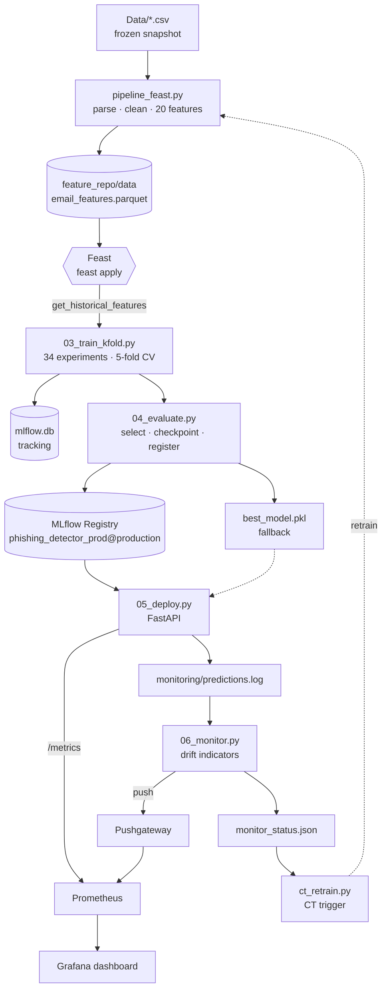

# Development and Operationalization of Data Science Solutions — Detection of Phishing Emails

An end-to-end machine learning system that classifies emails as **phishing** or
**safe**, built following the MLOps-based Data Science Process Model (MLOps-DSPM)
from conceptualization through to monitoring and continuous training.

Course project · Otto von Guericke University Magdeburg
Research group: Wirtschaftsinformatik / Very Large Business Applications (VLBA)
Advisors: Prof. Dr. Klaus Turowski, M.Sc. Christian Haertel

**Team:** Ayush Dhanker · Suraj Balaji Rautrao · Muhammed Ashiq Nizamudeen · Navyasri Vinjam

---

## What it does

Given the raw text of an email, the system predicts whether it is phishing or safe
and serves that prediction over a REST API. Behind the endpoint sits a full ML
lifecycle: a reproducible data pipeline writing into a Feast feature store, 34
tracked experiments in MLflow, a versioned model registry with an explicit
checkpoint decision, automated deployment tests, live Prometheus and Grafana
monitoring, and a continuous-training trigger that fires on drift.

Each numbered script maps to one DSPM stage and reads the previous stage's output,
so the whole lifecycle is reproducible from raw data to a monitored endpoint.

---

## Results

The selected model is a TF-IDF vectorizer with sublinear term frequency over 1–2
word n-grams, feeding a linear support vector classifier.

| Metric | Value |
|---|---|
| Cross-validation F1 (5-fold, weighted) | 0.9964 ± 0.0006 |
| Holdout accuracy | 0.9970 |
| Holdout F1 (weighted) | 0.9970 |
| Holdout AUC-ROC | 0.999988 |
| Checkpoint decision | PROCEED TO DEPLOYMENT |

Selection ranked on the cross-validation score, so the holdout numbers above are an
independent check rather than the criterion that picked the winner. Read them
alongside the [Limitations](#limitations-and-known-issues) section: the test split
is heavily skewed toward safe emails.

Full detail in `Evaluation_Report.md`.

---

## Architecture



---

## Quick start

**Prerequisites:** Python 3.10 and MLflow pinned to **3.10.1**. The pin matters. The
container and your local Python both read and write the same `mlflow.db`, and
whichever touches it first stamps a schema version the other may reject.

```bash
python -m venv .venv
source .venv/bin/activate           # Windows: .venv\Scripts\activate
pip install -r requirements.txt
```

Run the pipeline, stages 2 through 4:

```bash
python run_pipeline.py              # ~10 min
```

Or step by step, which is what the runner does internally:

```bash
python pipeline_feast.py            # stage 2b: parse, clean, write Parquet
cd feature_repo && feast apply      # register entity + feature view
cd ..
python 03_train_kfold.py            # stage 3: 34 experiments
python 04_evaluate.py               # stage 4: select, register, report
```

Serve the model:

```bash
uvicorn 05_deploy:app --port 8000
```

Interactive API docs at <http://localhost:8000/docs>.

Exercise the monitoring loop, with the API running in another terminal:

```bash
python send_test_predictions.py     # 30 sample emails, --repeat N for more
python 06_monitor.py                # compute drift indicators, write report
python ct_retrain.py --dry-run      # preview the retrain decision
```

Browse experiments:

```bash
mlflow ui --backend-store-uri sqlite:///mlflow.db
```

Stage 2a exploration is optional and independent of the rest:

```bash
python 01_eda.py                    # writes eda_plots/ and eda_summary.txt
```

---

## The pipeline, stage by stage

| Script | Stage | Role |
|---|---|---|
| `01_eda.py` | 2a | Exploratory data analysis |
| `pipeline_feast.py` | 2b | Parse, clean, engineer features, write to the feature store |
| `03_train_kfold.py` | 3 | 34 experiments with 5-fold CV, tracked in MLflow |
| `04_evaluate.py` | 4 | Select best model, checkpoint decision, register |
| `05_deploy.py` | 5 | FastAPI serving component |
| `06_monitor.py` | 6 | Drift and technical monitoring |
| `ct_retrain.py` | 6 | Continuous-training trigger |

`run_pipeline.py` chains stages 2b through 4. `get_training_data_from_feast.py` is a
shared helper that both training and monitoring import.

### Stage 2a — Exploration

`01_eda.py` reads train and test together and writes five plots to `eda_plots/` plus
`eda_summary.txt`. The findings that shaped later decisions:

- 30,651 emails total, no duplicate texts, no missing values.
- Phishing emails are **shorter**, averaging 80 words against 130 for safe email.
- Phishing emails carry more links, 0.95 per email against 0.61.
- Keywords like *verify*, *account*, *urgent* and *confirm* separate the classes
  clearly enough to justify keyword flags as engineered features.

Class balance across the combined set is 45.1 percent phishing, close enough that
accuracy is meaningful, though F1 remains the headline metric.

### Stage 2b — Data pipeline

The raw data is a **frozen local snapshot** of the HuggingFace dataset
`drorrabin/phishing_emails-data`, committed under `Data/` so every run uses identical
input. Each row arrives as a single text blob with the fields run together.

`pipeline_feast.py` splits that blob into date, sender, receiver, subject and body
using five regular expressions, collapses whitespace, and joins subject and body into
a `clean_text` column. Rows where parsing yielded nothing are dropped, which is why
the row counts shrink slightly:

| Split | Raw rows | After cleaning | Phishing share |
|---|---|---|---|
| Train | 26,946 | 26,906 | 50.1% |
| Test | 3,705 | 3,699 | 9.1% |

Twenty numeric features are engineered on top, in four groups:

- **Length and ratio** — `body_len`, `subject_len`, `word_count`, `char_per_word`,
  `digit_ratio`, `special_ratio`, `uppercase_ratio`
- **Links and sender** — `num_url`, `has_url`, `is_free_email`, `num_recipients`
- **Subject and body signals** — `subj_exclamation`, `subj_question`, `subj_urgent`,
  `subj_money`, `body_urgent`
- **Time of sending** — `send_hour`, `send_dow`, `is_weekend`, `date_parse_failed`

Dates that fail to parse, 9 in train and 1 in test, fall back to ingestion time so
every row still carries a valid typed timestamp for the offline store, with
`date_parse_failed` recording that the fallback was used. Median imputation fills
`send_hour` and `send_dow`, computed on train and applied to both splits.

The stage writes `Data_Quality_Report.md` alongside the Parquet output.

### The feature store

Feast sits between data preparation and training rather than passing CSV files
directly, so features are defined once and served consistently to every consumer.

- **Entity** `email_id`, unique across both splits as `train_<i>` and `test_<i>`.
- **Source** `feature_repo/data/email_features.parquet`, one table holding all rows
  from both splits, timestamped by `event_timestamp`.
- **Feature view** `email_features`, the 20 numeric features plus `clean_text`, with
  a ten-year TTL that effectively disables expiry for this offline dataset.
- **Entity files** `train_entities.parquet` and `test_entities.parquet` carry the
  keys, timestamps and labels used to pull each split back out.

Training and monitoring both retrieve through `store.get_historical_features()`, a
**point-in-time correct join** rather than a plain row lookup: each entity key is
matched against the feature values as they stood at that row's event timestamp, which
is the mechanism that prevents label leakage from future feature values.

`clean_text` is carried in the feature view because the vectorizers operate on raw
text, not on the 20 numeric features. Those numeric features are computed, stored and
served, but the winning model does not consume them.

`run_pipeline.py` runs `feast apply` and not `feast materialize-incremental`. That
populates the offline store, which is all the batch workflow needs. The SQLite online
store stays empty; materializing would only matter for low-latency online lookups.

### Stage 3 — Training

Six vectorizers times six classifiers gives 36 combinations. Two are excluded by the
`SKIP_PAIRS` set in `03_train_kfold.py`, sublinear TF-IDF paired with either Naive
Bayes variant, leaving **34 experiments** — matching the 34 rows in
`experiment_results.csv`.

| Vectorizers | Classifiers |
|---|---|
| tfidf_unigram, tfidf_bigram, tfidf_sublinear | linear_svc, logistic_regression, sgd_log_loss |
| bow_unigram, bow_bigram, hashing | multinomial_nb, complement_nb, random_forest |

Each combination runs twice. First, **5-fold stratified cross-validation on the
training set alone**, with training scores returned per fold. That gives a
train-minus-validation gap which is a direct overfitting signal that never touches
the holdout set. Second, a fit on the full training set evaluated against the true
holdout.

A gap above **0.05 weighted F1**, from either the cross-validation folds or the
train-to-test comparison, tags the run `overfitting_risk=True`. Everything lands in
MLflow under the experiment `phishing_email_classification`, with parameters,
metrics, the serialized pipeline, a classification report and a confusion matrix per
run. The summary table is written to `experiment_results.csv`.

### Stage 4 — Evaluation and checkpoint

Selection excludes any candidate flagged as an overfitting risk, then ranks the
remainder on **cross-validation F1**. Ties break on holdout AUC, preferring models
that expose `predict_proba`. Because selection uses the cross-validation score, the
holdout metrics remain an independent check rather than the thing being optimized.

Success criteria carried down from the Stage 1 business objectives:

| Criterion | Threshold | Result |
|---|---|---|
| Accuracy | ≥ 0.95 | PASS |
| F1 (weighted) | ≥ 0.94 | PASS |
| AUC-ROC | ≥ 0.95 | PASS |

All three pass, so the checkpoint decision is **PROCEED TO DEPLOYMENT** rather than a
return to business understanding. The winning pipeline is refit, pickled to
`best_model.pkl`, logged to MLflow, registered as `phishing_detector_prod` and given
the `production` alias. A confusion matrix and `Evaluation_Report.md` are written.

### Stage 5 — Deployment

`05_deploy.py` is a FastAPI application with three endpoints:

| Endpoint | Method | Purpose |
|---|---|---|
| `/` | GET | Health check, reports which model source loaded |
| `/metrics` | GET | Prometheus scrape target |
| `/predict` | POST | Classify one email |

The model loads from the registry alias `models:/phishing_detector_prod@production`
first, and falls back to `best_model.pkl` if the registry is unreachable. The
response reports which path was used.

```bash
curl -X POST http://localhost:8000/predict \
  -H "Content-Type: application/json" \
  -d '{"text": "URGENT: verify your password at http://secure-login-update.com"}'
```

```json
{
  "prediction": "phishing email",
  "label": 1,
  "confidence": null,
  "decision_score": 1.42,
  "confidence_type": "decision_margin",
  "model_source": "mlflow:models:/phishing_detector_prod@production"
}
```

The linear SVC has no `predict_proba`, so the response carries a **decision margin**
instead: the absolute distance from the separating hyperplane. It is not a
probability and should not be read as one. Larger means further from the boundary,
but there is no calibrated scale. When a probabilistic model is deployed instead, the
API fills `confidence` and sets `confidence_type` to `probability`.

Every prediction appends one JSON line to `monitoring/predictions.log` capturing
timestamp, text **length**, label, confidence or margin, and latency. The email text
itself is never written to disk.

Six Prometheus metrics are exported: predictions by class, errors by type, request
latency, input text length, prediction confidence, and decision margin.

### Stage 6 — Monitoring and continuous training

**No live accuracy, precision, recall or F1 is reported, and that is deliberate.**
Measuring them requires ground truth, whether each flagged email really was phishing,
which production does not supply. This is the verification-latency problem. Following
the DSPM utilization guidance, monitoring targets data and feature distributions
instead.

`06_monitor.py` reads the prediction log, pulls the training reference back out of
Feast, and evaluates four indicators:

| Indicator | Type | Threshold | Env override |
|---|---|---|---|
| Input length drift, Jensen-Shannon distance | statistical | > 0.20 breaches | `MONITOR_DRIFT_THRESHOLD` |
| Predicted phishing rate change | statistical | > 0.25 breaches | `MONITOR_PHISHING_RATE_DELTA` |
| Average decision margin | statistical | < 0.30 breaches | `MONITOR_LOW_MARGIN` |
| Request latency, 95th percentile | computational | > 500 ms breaches | `MONITOR_LATENCY_MS` |

Any breach sets `maintenance_needed`, which routes to **Perform Maintenance** and
triggers root cause analysis. The analysis reads the *pattern* across indicators
rather than any single breach:

- **Input shifted, output stable** — the signature of **covariate shift**. Retraining
  on the same dataset cannot fix it, since that reproduces the same model. The
  indicated resolution is dataset improvement: obtain training data matching the
  format and length the service actually receives.
- **Output shifted, input stable** — possible **concept shift**, an attack wave, or a
  broken upstream source. Labelled samples are needed before acting.
- **Both shifted** — the two can co-occur and cannot be separated without labels.
- **Technical only** — routes to infrastructure management, not to the model.

Results go to `Monitoring_Report.md`, `monitoring/monitor_status.json`, and five
gauges pushed to the Prometheus Pushgateway. A Pushgateway that is down logs a
warning and never breaks the monitoring run.

`ct_retrain.py` reads the status file and decides:

```bash
python ct_retrain.py --dry-run                  # decide, do not execute
python ct_retrain.py                            # retrain if the monitor flagged it
python ct_retrain.py --force "reason for audit" # retrain regardless
```

Retraining re-runs `feast apply`, then `pipeline_feast.py`, `03_train_kfold.py` and
`04_evaluate.py` in order, stopping at the first failure. The production alias moves
only if the new model passes the Stage 4 checkpoint, so a failed retrain leaves the
served model untouched. Every trigger appends to `CT_Trigger_Log.md` whether it ran,
was declined, was a dry run, or failed. Restart the API afterwards to pick up the new
version.

---

## Monitoring stack

```bash
docker compose up -d
```

| Service | Port | Purpose |
|---|---|---|
| `api` | 8000 | FastAPI serving component |
| `pushgateway` | 9091 | Receives batch indicators from `06_monitor.py` |
| `prometheus` | 9090 | Scrapes both the API and the gateway every 15s |
| `grafana` | 3000 | Dashboard, provisioned automatically, admin/admin |

Metrics reach Prometheus by two routes. Live operational metrics are **scraped** from
the API's `/metrics` endpoint continuously. Drift indicators are **pushed** to the
gateway by `06_monitor.py`, because that runs as a batch job with no endpoint of its
own to scrape.

The dashboard `Phishing Detector — Ops & Drift` is provisioned from
`grafana/dashboards/` and carries ten panels:

| Panel | Type | Metric |
|---|---|---|
| Prediction rate by class | timeseries | `phishing_predictions_total` |
| Request latency (p95, seconds) | timeseries | `phishing_request_latency_seconds_bucket` |
| Prediction errors (rate) | timeseries | `phishing_prediction_errors_total` |
| Input text length distribution | heatmap | `phishing_input_text_length_chars_bucket` |
| Input drift (Jensen-Shannon distance) | gauge | `phishing_monitor_input_drift_js` |
| Input drift over time | timeseries | `phishing_monitor_input_drift_js` |
| Live phishing rate | stat | `phishing_monitor_live_phishing_rate` |
| Maintenance needed? | stat | `phishing_monitor_maintenance_needed` |
| Avg decision margin | stat | `phishing_monitor_avg_decision_margin` |
| Predictions analysed | stat | `phishing_monitor_n_predictions` |

---

## Configuration

All configuration is environment variables with working defaults, read through
`python-dotenv`, so a `.env` file is optional.

| Variable | Default | Used by |
|---|---|---|
| `DATA_DIR` | `data` | `pipeline_feast.py` |
| `MLFLOW_TRACKING_URI` | `sqlite:///mlflow.db` | `05_deploy.py` |
| `MLFLOW_REGISTRY_MODEL_NAME` | `phishing_detector_prod` | `05_deploy.py` |
| `MONITOR_LOG_FILE` | `monitoring/predictions.log` | `05_deploy.py`, `06_monitor.py` |
| `API_HOST` | `0.0.0.0` | `05_deploy.py` |
| `API_PORT` | `8000` | `05_deploy.py` |
| `PUSHGATEWAY_URL` | `localhost:9091` | `06_monitor.py` |
| `MONITOR_MIN_PREDICTIONS` | `30` | `06_monitor.py` |
| `MONITOR_DRIFT_THRESHOLD` | `0.20` | `06_monitor.py` |
| `MONITOR_PHISHING_RATE_DELTA` | `0.25` | `06_monitor.py` |
| `MONITOR_LOW_MARGIN` | `0.30` | `06_monitor.py` |
| `MONITOR_LATENCY_MS` | `500` | `06_monitor.py` |

---

## Testing

```bash
pytest test_deploy.py -v
```

Nine tests cover the serving component: the health check and its model source, the
Prometheus endpoint's content type and its response to traffic, a phishing-shaped and
a safe-shaped prediction including the confidence contract, three input validation
cases (empty text rejected with 400, missing field and wrong type rejected with 422),
and the logging side effect verified against a temporary file.

The tests import the app directly through `importlib`, because a module name starting
with a digit cannot be imported with normal syntax. Run evidence is in
`docs/stage5-deployment_test.png`.

---

## Repository layout

```
├── 01_eda.py                       # stage 2a
├── pipeline_feast.py               # stage 2b
├── 03_train_kfold.py               # stage 3
├── 04_evaluate.py                  # stage 4
├── 05_deploy.py                    # stage 5
├── 06_monitor.py                   # stage 6, monitoring
├── ct_retrain.py                   # stage 6, CT trigger
├── run_pipeline.py                 # chains stages 2b-4
├── get_training_data_from_feast.py # shared Feast retrieval helper
├── send_test_predictions.py        # 30-email smoke client
├── test_deploy.py                  # 9 deployment tests
│
├── Data/                           # frozen raw snapshot, committed
├── feature_repo/                   # Feast: definitions, registry, Parquet
├── monitoring/                     # prediction log, monitor status
├── grafana/                        # dashboard JSON + provisioning
├── eda_plots/                      # 5 exploration plots
├── docs/                           # test run evidence
├── mlruns/, mlflow.db              # MLflow tracking store
│
├── Dockerfile, docker-compose.yml  # 4-service stack
├── prometheus.yml                  # scrape config
└── requirements.txt
```

## Generated artifacts

These are outputs, not source. Each is rewritten when its script runs.

| Artifact | Written by |
|---|---|
| `eda_summary.txt`, `eda_plots/*.png` | `01_eda.py` |
| `Data_Quality_Report.md` | `pipeline_feast.py` |
| `feature_repo/data/*.parquet` | `pipeline_feast.py` |
| `experiment_results.csv` | `03_train_kfold.py` |
| `Evaluation_Report.md`, `confusion_matrix_best.png` | `04_evaluate.py` |
| `best_model.pkl` | `04_evaluate.py` |
| `monitoring/predictions.log` | `05_deploy.py` |
| `Monitoring_Report.md`, `monitoring/monitor_status.json` | `06_monitor.py` |
| `CT_Trigger_Log.md` | `ct_retrain.py` |

---

## Limitations and known issues

**The test split is heavily skewed.** Training is an even 50.1 percent phishing,
while the test split is 90.9 percent safe. That asymmetry is why phishing precision
sits at 0.968 against a recall of 1.000: with only 336 phishing emails among 3,699,
a handful of false positives moves precision noticeably while barely touching
accuracy. The headline accuracy figure should be read with that in mind, and the
per-class report in `Evaluation_Report.md` is the more informative view.

**The drift indicator has a baseline mismatch.** The reference distribution is the
length of parsed `clean_text`, while the live log records the length of the raw text
submitted to the API. Part of the persistent drift breach recorded in
`monitoring/monitor_status.json` is that mismatch rather than genuine shift.
`06_monitor.py` notes this in its own report. Aligning the two would mean either
measuring raw length on the reference side or parsing incoming requests the same way
the pipeline does.

**Experiment artifacts are committed to git.** `mlruns/` is roughly 1,700 tracked
files and about two gigabytes, which has taken `.git` to 311 MB, and `mlflow.db.bak`
is committed alongside it. Cloning is slow as a result. The fix is to ignore the
directory and point the tracking store at storage outside the repository, keeping
only the reports and the selected model under version control.

**The default data path is case sensitive.** `pipeline_feast.py` defaults `DATA_DIR`
to `data` while the committed directory is `Data`. Windows resolves this
transparently. The Linux container built from the Dockerfile does not. Set
`DATA_DIR=Data` when running on a case-sensitive filesystem.

**Exploration paths are hardcoded.** `01_eda.py` reads `data/...` directly rather
than honouring `DATA_DIR`, so the override above does not reach it.

**No online feature serving.** The Feast online store is configured but never
materialized, since the batch workflow retrieves everything through the offline
store. Low-latency online lookups would need `feast materialize-incremental` added to
the pipeline.

---

## Tech stack

Python 3.10 · scikit-learn · Feast · MLflow · FastAPI · Prometheus · Grafana ·
Docker · pytest

---

## License

MIT
